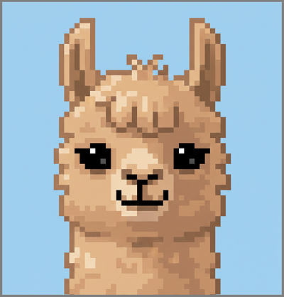
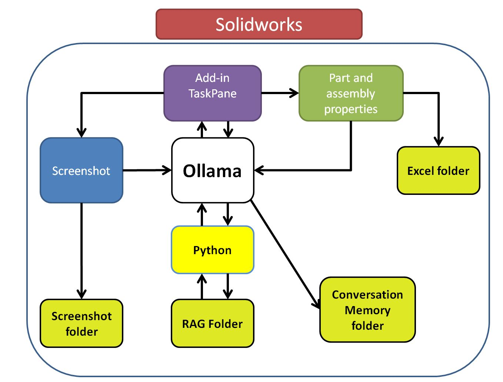
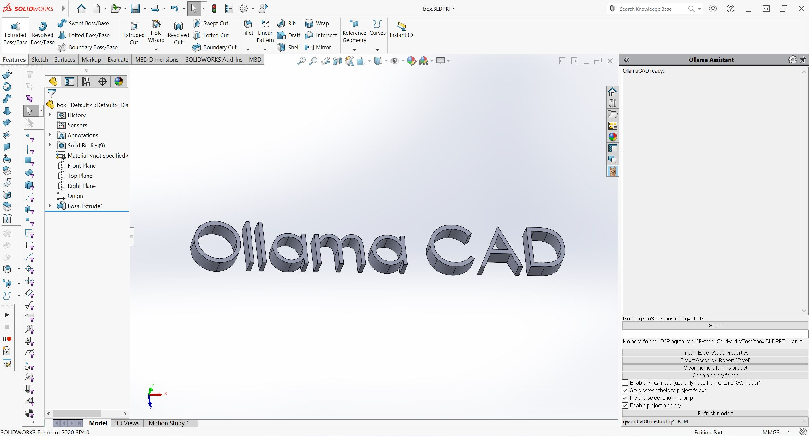

  

# 🚀 OllamaCAD
## AI-Powered SOLIDWORKS Add-in using Ollama & NVIDIA GPU Acceleration

OllamaCAD connects SOLIDWORKS, local LLMs, multimodal vision models, and engineering document retrieval into a single GPU-accelerated AI assistant embedded directly inside the CAD environment.

It combines:

	🟢 Local LLM inference via Ollama

	🟢 Vision-language models (choose from Ollama list - Qwen3-VL, Gemma3 etc.)

	🟢 GPU acceleration using NVIDIA RTX hardware

	🟢 Context-aware CAD analysis

	🟢 RAG (Retrieval-Augmented Generation) for engineering documentation

This is not a chatbot.

This is context-aware AI for mechanical design workflows.

## 🎯 Competition Focus

This project demonstrates:

🔹 On-device LLM deployment using Ollama

🔹 GPU-accelerated inference on NVIDIA RTX

🔹 Integration of AI directly inside professional CAD software

🔹 Secure, air-gapped AI (no cloud, no data leakage)

🔹 Hybrid multimodal workflows (text + screenshot + CAD metadata)

Built as a real industrial prototype.

## ⚙️ Technology Stack

Core

C# (.NET Framework 4.7.2, x64)

SOLIDWORKS API (COM Interop)

Taskpane Add-in architecture

AI Layer

Ollama (local model serving)

Qwen3-VL (Vision-Language Model)

Gemma 3 (QA model)

Qwen Embedding model (RAG)

Custom Python RAG pipeline (FAISS)

Hardware

Optimized for NVIDIA RTX GPUs

Fully local GPU inference

No cloud dependency

## 🔍 Key Capabilities
### 1️⃣ Context-Aware CAD Assistant

Reads:

Active document metadata

Selected component properties

Mass properties

Materials

Custom properties

Units

Configuration data

Then injects that context into the LLM prompt.

### 2️⃣ Screenshot-Based Visual Reasoning

Captures SOLIDWORKS window

Sends image + text to Qwen3-VL

Enables drawing correction, dimension validation, visual QA

### 3️⃣ Engineering RAG System

Index technical PDFs, txt, csv, xlsx, jpg, png

OCR using vision model

FAISS vector search

Engineering Q&A inside SOLIDWORKS

### 4️⃣ Assembly Excel Export / Import

Extract assembly metadata

Mass properties

Interference check results

Feature counts

Custom properties

Export to Excel (OpenXML)

Modify properties via Excel → re-import

## 🔐 Security & Industrial Relevance

Fully offline

No cloud API

No data leakage

Suitable for aerospace / automotive suppliers

Compatible with controlled engineering environments

## 🏗 Architecture

  

## 🧠 Example

  

## 🧩 Why This Matters

Most AI tools for CAD are:

Cloud-based

Generic chatbots

Not context-aware

Not integrated into engineering workflows

OllamaCAD demonstrates:

AI embedded directly into professional CAD software, powered locally by NVIDIA GPU acceleration.

This represents a step toward:

AI-assisted design validation

Automated engineering documentation review

Local generative design workflows

Secure enterprise AI deployment

## 🖥 Requirements

Windows 10/11 (x64)

SOLIDWORKS 2020+

.NET Framework 4.7.2

Ollama installed

NVIDIA RTX GPU recommended

Python 3.12 (for RAG)

## 🛠 Installation

See release/README_INSTALL.txt

but you will need:

- [Solidworks 2020+](https://www.solidworks.com/)

- [Ollama](https://ollama.com)

- [Python 3.12.7](https://www.python.org/downloads/release/python-3127/)

- [Poppler for Windows](https://github.com/oschwartz10612/poppler-windows/releases/)

## 📎 Competition Submission

This project was developed as an entry for:

Ollama + NVIDIA GTC Golden Ticket Competition

It demonstrates:

Local LLM deployment

Multimodal AI in engineering

GPU acceleration in professional workflows

Industrial-grade integration

## 📄 License
